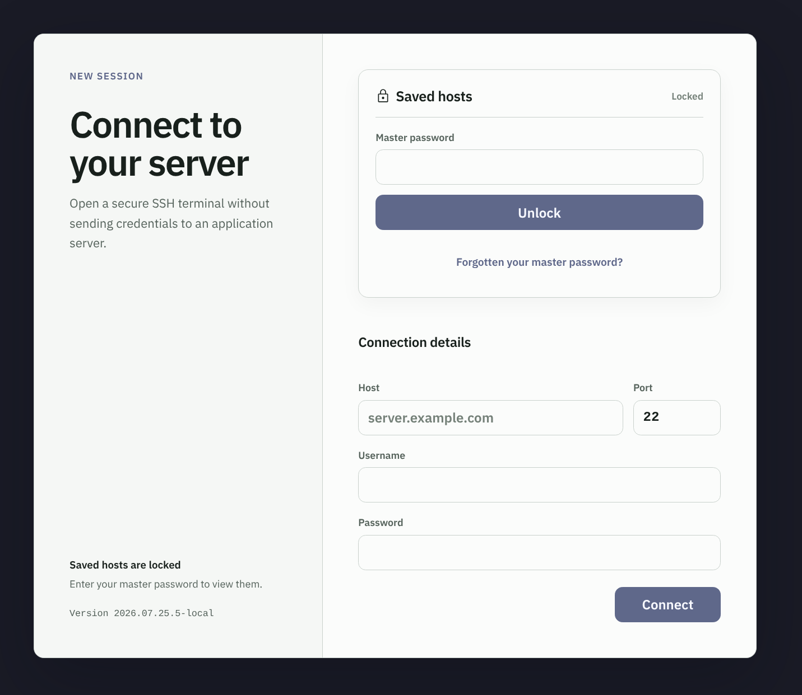
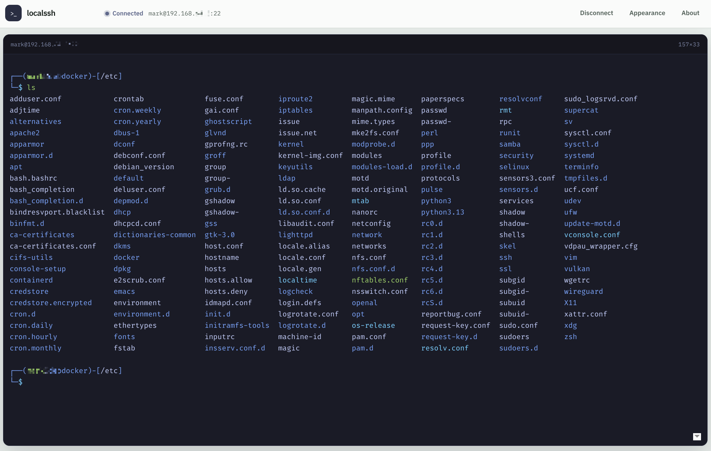

# localssh

An SSH client that runs in the browser. The SSH implementation is compiled to
WebAssembly and runs in the page, so the handshake, password authentication,
and host-key verification all happen on your device. The relay in between moves
encrypted bytes and cannot read the session.

The relay exists because browsers cannot open raw TCP sockets. It is a dumb
pipe: it never sees your password, and a malicious relay cannot impersonate a
server without failing the host-key check performed in the browser.

If you find this useful, please consider starring the repository. It helps
others discover the project.

## Features

- **Browser-native SSH.** The Go SSH engine runs as WebAssembly in the tab.
  Password authentication, host-key verification, and terminal I/O stay between
  the browser and the SSH server.
- **Encrypted saved hosts.** The optional [address book](#address-book) saves a
  nickname, host, port, username, and optionally a password. The entire address
  book is encrypted under a master password before it enters browser storage.
- **Known-host verification.** First connections show the server's SHA-256
  fingerprint. Accepted keys are remembered in the browser, and a changed key
  produces a separate security warning before any connection continues.
- **Configurable terminal.** The [terminal](#terminal) supports selectable font
  size, system or bundled monospace fonts, persistent colour schemes,
  scrollback, automatic PTY resizing, and full-screen sessions.
- **Phone and tablet controls.** The responsive interface includes a
  [touch key bar](#key-bar), sticky Ctrl and Alt modifiers, terminal gestures,
  keyboard-aware viewport fitting, and 44px touch targets.
- **Self-hosted LAN deployment.** Docker Compose serves the frontend and relay
  through one port. Origin, target host, target port, concurrent session, and
  connection-time limits constrain relay access and resource use.
- **No application account or credential server.** Typed passwords are not
  persisted. Saved credentials remain encrypted in that browser profile, and
  the relay carries only the end-to-end encrypted SSH stream.

## Interface preview





## Repository layout

| Path       | What it is                                                       |
| ---------- | ---------------------------------------------------------------- |
| `engine/`  | Go SSH engine compiled to WebAssembly, plus a test SSH server     |
| `relay/`   | Node WebSocket-to-TCP relay                                      |
| `frontend/`| React and Vite UI with the xterm.js terminal                      |

## Install with Docker

Docker Compose pulls and starts the published frontend and relay images. Install
Docker Engine with the Compose plugin, or Docker Desktop. No local Go or Node
installation is required.

```bash
git clone https://github.com/bradsec/localssh.git
cd localssh
docker compose up -d
```

Open <http://localhost:9080>.

### Update to a new release

Pull the new images and recreate the containers. Compose replaces only what
changed, and a session is only interrupted for as long as the containers take to
restart:

```bash
cd localssh
git pull
docker compose pull
docker compose up -d
```

`git pull` matters when `compose.yaml`, the relay proxy configuration, or the
`.env.example` defaults changed in the release; your own `.env` is never touched.

This tracks the `latest` tag. To move deliberately between releases, set the
version in `.env` and recreate. Published versions are listed on the
[releases page](https://github.com/bradsec/localssh/releases):

```dotenv
LOCALSSH_VERSION=YYYY.MM.DD
```

Old images stay on disk after an update. Remove the ones no longer referenced
with `docker image prune`.

### Stop or remove the Docker installation

Stop and remove the application containers and network:

```bash
docker compose down
```

To also remove the downloaded frontend and relay images:

```bash
docker compose down --rmi all --remove-orphans
```

These commands do not remove the source checkout or `.env` configuration.

The web interface binds to `127.0.0.1` by default. The frontend proxies relay
traffic internally through the same web port, so the relay does not need a
separate published port.

### Access from a local network

This is the intended deployment: install localssh on one server, and everyone
else on the network uses it as their SSH client from a browser. Each visitor's
own browser runs the SSH engine and stores its own known hosts, so nothing about
one person's session is shared with another.

Give the server a stable LAN address or hostname, then copy and edit the
configuration:

```bash
cp .env.example .env
```

For a server at `192.168.1.20`, use:

```dotenv
BIND_ADDRESS=0.0.0.0
FRONTEND_PORT=9080
ALLOWED_ORIGINS=*
ALLOWED_HOSTS=server.example.com,*.internal.example
ALLOWED_PORTS=22
```

Start the application and open <http://192.168.1.20:9080> from another
computer:

```bash
docker compose up -d
```

Allow inbound TCP port `9080` from the trusted LAN in the server firewall.

`ALLOWED_ORIGINS=*` is the recommendation for a firewalled local network because
visitors arrive by whatever address they typed: the LAN IP, a short hostname, an
mDNS `.local` name. An exact-match list has to name every one of them, and an
address that changes with a DHCP lease breaks the deployment. What the wildcard
costs: any page open in a visitor's browser can also reach the relay and dial the
hosts you allowlisted. `ALLOWED_HOSTS` is therefore the boundary that matters,
so keep it to the hosts you intend, not `*`.

To keep an exact-match list instead, name every URL people use, including the
ones used on the server itself:

```dotenv
ALLOWED_ORIGINS=http://192.168.1.20:9080,http://server.local:9080,http://localhost:9080
```

Do not expose this HTTP service directly to the internet. Any browser that can
reach it can use the unauthenticated relay to connect to `ALLOWED_HOSTS`, and
plain HTTP does not protect the page from modification in transit. Use a
restrictive target allowlist and put an internet-facing deployment behind an
authenticated HTTPS reverse proxy.

### When a browser cannot connect

A browser is not told why a WebSocket handshake failed: the relay's 403 and its
reason are hidden from the page, which can only report that the relay could not
be reached. The relay logs every refusal with the value it rejected, so check
there first:

```bash
docker compose logs relay
```

A refused origin means the address that visitor used is not in
`ALLOWED_ORIGINS`; a refused target means the host or port they asked for is not
in `ALLOWED_HOSTS` or `ALLOWED_PORTS`.

### Configuration

Copy the example before changing the bind address, port, or target allowlist:

```bash
cp .env.example .env
```

| Variable | Default | Meaning |
| -------- | ------- | ------- |
| `BIND_ADDRESS` | `127.0.0.1` | Host interface for the web port. Use `0.0.0.0` for LAN access. |
| `FRONTEND_PORT` | `9080` | Host port for the web interface. |
| `ALLOWED_ORIGINS` | local frontend URLs | Browser origins allowed to use the relay, matched exactly. `*` allows any origin, which is the practical setting for a firewalled LAN. |
| `ALLOWED_HOSTS` | `*` | Comma-separated target hosts. `*.example.com` matches subdomains. |
| `ALLOWED_PORTS` | `22` | Comma-separated target TCP ports. |
| `MAX_SESSIONS` | `256` | Maximum concurrent relay sessions. New sessions receive HTTP 503 at capacity. |
| `TARGET_CONNECT_TIMEOUT_MS` | `10000` | Maximum time in milliseconds for the relay to establish a target TCP connection. |

`LOCALSSH_VERSION` selects the container image tag. Leave it unset to track the
latest release, or set it to a published `YYYY.MM.DD` or `YYYY.MM.DD.N` release
for repeatable installs.

Unless it is `*`, `ALLOWED_ORIGINS` must contain every exact URL used to open the
interface, including its scheme, hostname or address, and non-default port. For a
private set of SSH targets, replace `*` with explicit names:

```dotenv
ALLOWED_HOSTS=server.example.com,*.internal.example
```

### Changing ports

Edit `.env` and keep the allowed origin synchronized with the published web
port. For example, to use port `9180` locally:

```dotenv
FRONTEND_PORT=9180
ALLOWED_ORIGINS=http://localhost:9180,http://127.0.0.1:9180
```

Recreate the containers after changing these values:

```bash
docker compose up -d
```

Then open <http://localhost:9180>. If Docker reports that the port is already
allocated, choose an unused `FRONTEND_PORT` and update `ALLOWED_ORIGINS`.

## Versioning

localssh uses calendar versions in `YYYY.MM.DD` format. Same-day patch releases
append a revision number as `YYYY.MM.DD.N`.

`VERSION` holds the release, and nothing else in the repository repeats it:
releasing is a one-line edit to that file. The frontend build reads it, the
release workflow validates it and passes it to both image builds as the
`VERSION` build argument, which becomes the image tag and the OCI metadata. The
npm packages are private and never published, so they carry a fixed `0.0.0`
rather than a copy of the release, and a container built by hand with no build
argument labels itself `development`.

The connect panel and the About panel both show the running version, so anyone
can read it without inspecting the containers.

Changing `VERSION` on `main` runs the release workflow. The workflow validates
the calendar date, runs the engine, relay, and frontend checks, publishes
multi-platform frontend and relay images to GitHub Container Registry, and
creates a matching `vYYYY.MM.DD` or `vYYYY.MM.DD.N` GitHub release. Each
calendar version can be released only once.

## Security model

What this design does and does not protect you from:

- **The relay cannot read your session.** SSH is negotiated end to end between
  the browser and the target, so the relay only ever sees ciphertext.
- **Host keys are verified in the browser.** On first connection you are shown
  the SHA-256 fingerprint and must accept it. Accepted keys are stored in
  IndexedDB, and a later change is reported as a warning you must confirm.
- **Typed passwords stay in memory.** A password you type lives in React state
  for the life of the connection and is never written to storage or sent to any
  origin server.
- **Saved passwords are encrypted on your device.** The optional address book
  seals every saved host under a master password, using Argon2id and
  XChaCha20-Poly1305 inside the WebAssembly engine. A saved password is never
  written in plain text, never leaves the browser, and is never handed to the
  page: the engine holds it and uses it directly when you connect.
- **Anyone who can reach your relay can dial the hosts you allowlisted.** The
  relay does not authenticate users. Keep `ALLOWED_HOSTS` tight, and put the
  relay behind access control if it faces the internet.
- **This has not been independently audited.** Treat it accordingly.

## Address book

Saving hosts is optional and off until you set a master password. Without one,
localssh stores no credentials at all.

Each saved host carries a nickname and, at your choice, the host alone, the
host and username, or the host, username, and password. Picking an entry that
holds everything connects in one tap; anything less fills the form and waits
for the rest.

Saved entries can be edited or deleted from their options menu. The vault can
be locked without reloading the page, and its master password can be changed
after entering the current password. If the password is lost, deleting the
whole vault requires typing an explicit confirmation phrase.

### How it is protected

The master password is stretched with Argon2id and the address book is sealed
with XChaCha20-Poly1305. Both run in the WebAssembly engine rather than through
the browser's WebCrypto, because `crypto.subtle` is unavailable over plain
HTTP, which is how a LAN deployment is normally reached. The derived key never
leaves the engine, and neither does a saved password: connecting passes a
reference to the entry, and the engine supplies the password itself.

The vault is a single encrypted blob in `localStorage`. Nicknames, hostnames,
and usernames are inside it, so a reader of your browser storage learns only
that a vault exists.

An unlock lasts one page load. Reloading, opening a new tab, or restarting the
browser asks for the master password again.

Setting the master password asks for it twice, because there is no recovery
from a typo. A strength meter sits under the field. It is guidance only: it
never blocks a password, and it applies no character-class rules. This draws
on the usability guidance in NIST SP 800-63B-4, where length is a primary
factor and mandatory symbol rules are prohibited. It is not a claim of NIST
compliance: this is a local encryption feature, and its small common-password
list gives feedback rather than acting as a verifier blocklist. The meter rates
the password alone. A weak master password makes a weak vault whatever the
encryption behind it is.

### What it does not protect you from

- **There is no recovery.** Forgetting the master password means the saved
  hosts are gone. The only way forward is to delete the vault and start again.
- **A saved password is only as strong as the master password over it.** The
  Argon2id parameters make guessing expensive, not impossible.
- **Anyone with the device and the master password has the credentials.**
- **A shared server means a shared browser profile.** If several people use the
  same browser on the same machine to reach localssh, they share one vault. On
  the LAN deployment this README recommends, each visitor uses their own browser
  on their own device, and their vaults stay separate. Do not create a vault in
  a browser other people use.
- **This has not been independently audited.** Treat it accordingly.

## Terminal

Font, font size, and colour scheme are configurable from the Appearance menu
and persist in `localStorage`. System Monospace is the default; Fira Code,
JetBrains Mono, Cascadia Code, IBM Plex Mono, and Source Code Pro are available
as optional bundled fonts. Font size is a picker, which a phone renders as a
scroll wheel. The terminal reports its fitted size to the remote PTY, so
resizing the window, rotating a phone, or opening an on-screen keyboard keeps
width-aware commands formatting correctly.

## Phones and tablets

The interface is built for a small touch screen as much as for a desktop
browser. On a phone the terminal runs to the edges of the screen, the toolbar
reflows so the session identity keeps its own line, and controls stay at or
above the 44px touch target. Pinch-zoom is disabled over the terminal, where
zooming would hide the prompt and reflow nothing: set the font size from the
Appearance menu instead.

While a session is up, the shell follows the visual viewport rather than the
page, so the terminal refits into whatever the on-screen keyboard leaves and the
cursor row stays above it. Tapping the terminal raises the keyboard, and
dismissing it is left to the keyboard's own control.

### Key bar

A touch device gets a key bar along the bottom of the session, carrying the keys
a phone keyboard has none of. It stays up for the whole session, above the
on-screen keyboard when that is open and on its own when it is not:

| Keys                       | Notes                                              |
| -------------------------- | -------------------------------------------------- |
| Keyboard icon              | Raises and dismisses the on-screen keyboard, for reading output on a full screen and typing again without hunting for the terminal. |
| `ctrl`, `alt`              | Sticky. One tap arms them for the next key, a second locks them until tapped off. |
| `↑`, `↓`, `⏎`              | Recall a command and run it without opening the keyboard at all. |
| `esc`, `tab`               |                                                    |
| `^C`, `^D`, `^Z`           | Interrupt, end of input, suspend.                  |
| `←`, `→`, `home`, `end`    | Sent in whichever encoding the terminal is in, so they work inside `vim` and `less`. |
| `\|`, `/`, `~`, `-`        | Punctuation buried behind a shift on a phone.      |

With `ctrl` armed, a letter typed on the system keyboard arrives as its control
code, so `ctrl` then `r` is a reverse history search. The bar scrolls sideways
when the screen is too narrow for all of it, and tapping a key never takes focus
from the terminal, so the keyboard does not close underneath it.

### Touch gestures

For devices with no physical Tab or arrow keys:

| Gesture            | Action           |
| ------------------ | ---------------- |
| Swipe right        | Tab              |
| Swipe left         | Esc              |
| Flick up or down   | Command history  |

Vertical flicks defer to scrollback: while you are reading history, vertical
drags scroll normally. Dragging with two fingers scrolls the output.

## Development

Development from source requires Go 1.26 or newer and Node.js 22 or newer.

```bash
# Engine
cd engine && go test ./... && GOOS=js GOARCH=wasm go vet ./...

# Relay
cd relay && npm test

# Frontend
cd frontend && npm test && npm run lint && npx tsc -b && npm run build

# Browser end-to-end test (builds the engine, starts a test sshd and relay)
cd frontend && npm run test:e2e
```

## Credits and acknowledgements

### Libraries

| Project | Used for | Licence |
| ------- | -------- | ------- |
| [xterm.js](https://github.com/xtermjs/xterm.js) (`@xterm/xterm`, `@xterm/addon-fit`) | Terminal emulator and sizing | MIT |
| [golang.org/x/crypto](https://pkg.go.dev/golang.org/x/crypto/ssh) | Go SSH client implementation | BSD-3-Clause |
| [Go](https://go.dev) and its `syscall/js` WebAssembly support | The engine and its browser bridge | BSD-3-Clause |
| [React](https://react.dev) | UI | MIT |
| [Vite](https://vite.dev) | Build tooling and dev server | MIT |
| [TypeScript](https://www.typescriptlang.org) | Type checking | Apache-2.0 |
| [Vitest](https://vitest.dev) | Unit tests | MIT |
| [Playwright](https://playwright.dev) | Browser end-to-end tests | Apache-2.0 |
| [Testing Library](https://testing-library.com) | Component test helpers | MIT |
| [oxlint](https://oxc.rs) | Linting | MIT |
| [idb](https://github.com/jakearchibald/idb) | IndexedDB wrapper for known hosts | ISC |
| [ws](https://github.com/websockets/ws) | WebSocket server for the local dev relay | MIT |

### Fonts

All bundled through [Fontsource](https://fontsource.org).

| Font | Designer | Licence |
| ---- | -------- | ------- |
| [Fira Code](https://github.com/tonsky/FiraCode) | Nikita Prokopov, from Fira Mono by Erik Spiekermann and Carrois Apostrophe | SIL OFL 1.1 |
| [JetBrains Mono](https://www.jetbrains.com/lp/mono/) | JetBrains | SIL OFL 1.1 |
| [Cascadia Code](https://github.com/microsoft/cascadia-code) | Microsoft | SIL OFL 1.1 |
| [IBM Plex Mono and IBM Plex Sans](https://github.com/IBM/plex) | Mike Abbink and Bold Monday for IBM | SIL OFL 1.1 |
| [Source Code Pro](https://github.com/adobe-fonts/source-code-pro) | Paul D. Hunt for Adobe | SIL OFL 1.1 |

### Colour schemes

Terminal palettes reproduce the published colours of their upstream projects:
[Solarized](https://ethanschoonover.com/solarized/) (Ethan Schoonover, MIT),
[Dracula](https://draculatheme.com) (Zeno Rocha, MIT),
[Nord](https://www.nordtheme.com) (Arctic Ice Studio, MIT),
[Gruvbox](https://github.com/morhetz/gruvbox) (Pavel Pertsev, MIT),
[One Dark](https://github.com/atom/atom) (Atom, MIT),
[Monokai](https://monokai.pro) (Wimer Hazenberg),
[Catppuccin](https://github.com/catppuccin/catppuccin) (MIT), and
[Tokyo Night](https://github.com/enkia/tokyo-night-vscode-theme) (MIT).

### Interface icons

Interface icons use
[Material Symbols](https://github.com/google/material-design-icons) by Google,
vendored as SVG paths under the Apache-2.0 licence.

The GitHub mark in the About panel is a trademark of GitHub, Inc., used to link
to the project's repository.

## Licence

[MIT](LICENSE)
